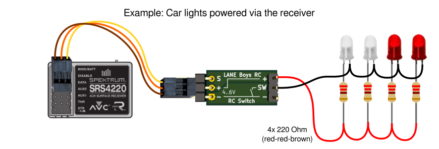
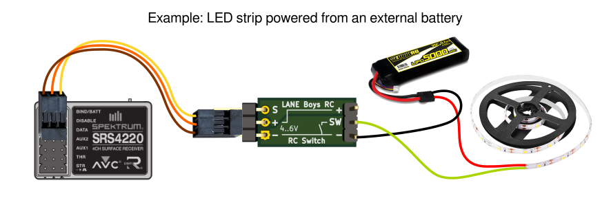
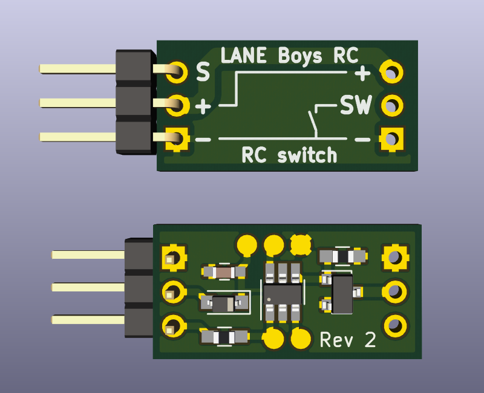
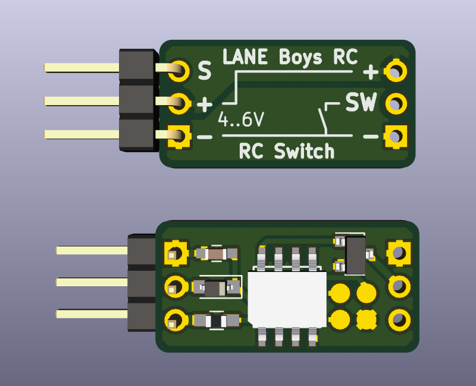

# Simple switch for RC systems

The RC Simple Switch allows you to turn an electronic load mounted to your RC model on or off remotely through your transmitter.

For example you can turn LEDs powered via the receiver on and off, or a light strip powered from an external battery.

The circuit board measures 20 x 10mm (0.8 x 0.4"), excluding connectors. The switch can handle loads of up to 2A @ 20V.

Servo pulses range from 1 .. 2ms, with 1.5ms being defined as center position.
The switch turns on when the incoming servo pulse is greater than 1.6ms, and turns off again when the servo pulse becomes less than 1.4ms.
This hysteresis makes it suitable for use with both switches and analog controls.

Power consumption of the RC switch itself (without load) is about 4mA.

If you want such a RC switch but do not want to build it yourself, you can obtain one from [laneboysrc@gmail.com](mailto:laneboysrc@gmail.com)

# Electronics

There are two variants provided, both with identical size and functionality:

### Microchip PIC10F200 variant

### STC STC15W104 variant

Which one you choose depends on how easy it is for you to get the respective chips, your familiarity with them, and whether you already have respective programming tools.

The PIC10F200 version requires a Microchip Pickit for programming, which can be quite an investment. The PIC10F200 can be obtained from major electronics distributors like Digikey, Element14, Mouser ...

The STC15W104 can be programmed using a simple USB-to-serial converter, or a Raspberry Pi (or similar SBC with a serial port). The STC15W104 originates from China and can be found on eBay and Aliexpress.

Both chips come in DIP package versions so you can easily build the hardware on a prototyping board.

There is also a PCB for SMD components available for both variants. Gerber files are provided so you can order PCBs from you favorite manufacturer.

# Firmware

Pre-compiled HEX files are supplied: [PIC10F200 firmware](rc-simple-switch-pic10f200.hex) [STC15W104 firmware](rc-simple-switch-stc15w104.hex)

The firmware for both variants can be compiled with the [SDCC compiler](http://sdcc.sourceforge.net/).

For programming the PIC10F200 variant please consult Microchip for the required tools and software.

For programming the STC15W104 variant we recommend the [STCGAL](https://github.com/grigorig/stcgal), an open source Python program.
